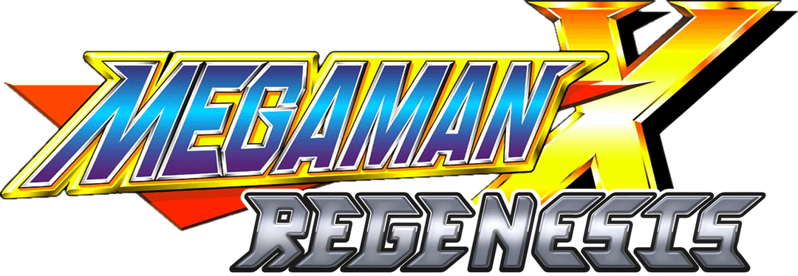

<div align=center>



</div>
<h1 align=center>Mega Man X Regenesis — Nintendo Switch port (Godot 4.7)</h1>

A wrapper/port of the Android release of Mega Man X Regenesis, a free fan game by
[mmxregenesis](https://mmxregenesis.itch.io/mega-man-x-regenesis) built on **Godot 4.7**. This Nintendo Switch port is an unofficial, fan-made port. **It has no affiliation or connection with mmxregenesis project/team and Capcom**.

It loads the original engine binaries (`libgodot_android.so`, `libc++_shared.so`),
resolves their imports against native Switch implementations and patches them so the
game runs inside a minimal Android environment (fake JNI, a bionic→newlib libc shim,
audio and input). Rendering goes through Godot's **Vulkan** backend on the Switch's
NVK (Nouveau Vulkan / Mesa) driver.

> [!NOTE]
> Mega Man X Regenesis is a **free** fan game — get it from their
> [official itch.io page](https://mmxregenesis.itch.io/mega-man-x-regenesis). This
> port targets the **Android build (game version 1.00.7)**; the ABI is tied to the
> Godot engine build, so a future game version that ships a newer engine may need
> re-checking (a content-only update like this one just works).

> [!WARNING]
> You might find the same bugs/issues happening on PC/Android. 
> The game is closed-source, so there's no way for me to fix these bugs/issues.

## How to install

Create a folder for the game on your SD card, `/switch/mmxregenesis_nx/`, and place:

1. `mmxregenesis_nx.nro`.
2. The two `.so` libraries and the `assets` folder from the Mega Man X Regenesis
   APK. Open the APK with 7-Zip or another ZIP extractor: copy the libraries out of
   `lib/arm64-v8a/` into the folder and **copy the whole `assets/` folder.**

```text
/switch/mmxregenesis_nx/
  mmxregenesis_nx.nro
  libgodot_android.so       (arm64-v8a engine binary, from the APK)
  libc++_shared.so          (arm64-v8a C++ runtime, from the APK)
  assets/                   (the APK's assets/ folder)
```

The two `.so` files can sit next to the `.nro` (as above) **or** grouped inside a
`lib/` subfolder (`/switch/mmxregenesis_nx/lib/libgodot_android.so`, and so on) if you
prefer a tidier root — the loader checks both locations.

Launch with a game override (hold **R** while starting an installed title) or a
forwarder. Album applet mode doesn't provide enough memory (the engine alone is
~67 MB) or the required code-memory permissions. 

I suggest using the latest version of [Sphaira](https://github.com/NaGaa95/sphaira) to generate the forwarder. 

Finally **CHECK [THIS SCREENSHOT](https://i.imgur.com/W4hpDcY.jpeg)** to know which options you must use to generate the forwarder.

> [!NOTE]
> `config.txt` and `override.cfg` are written automatically on first boot — you don't
> need to create them. The first launch also builds an asset pack
> (`assets.nxpack` / `assets.nxidx`) and a shader cache, **so it takes longer than
> later ones**.

> [!NOTE]
> **Updating the game:** when a new game version comes out, just replace the
> `assets/` folder with the new one. The wrapper notices the assets are newer than
> its pack and rebuilds it automatically on the next launch — no need to delete
> anything by hand.

## Controls

The full Switch controller is handed to the game. Input is gamepad-only — the
touchscreen and gyro are not used.

| Input | Action |
| --- | --- |
| Left stick / D-pad | Move (all directions) |
| A | Jump |
| X | Shoot |
| R | Dash |
| Right stick | Weapon wheel |
| + | Pause |

These are the defaults — the buttons are **remappable from the game's own Input
Settings menu**, so you can set them to your taste in-game.

## Configuration

`config.txt` (auto-generated in the game folder) exposes a handful of options:

```text
screen_width 1280
screen_height 720
deadzone 18
assetpack 1
enable_vulkan 1
```

| Key | What it does |
| --- | --- |
| `screen_width` / `screen_height` | Render resolution (see below). |
| `deadzone` | Analog-stick dead zone, in percent (`0` disables it). |
| `assetpack` | `1` folds the loose game files into an indexed on-device pack on first boot for faster SD loading; `0` reads the loose files. |
| `enable_vulkan` | `1` uses the Vulkan renderer (recommended); `0` forces the GLES3 fallback. |

## Resolution

Both handheld and docked render at **1280x720** by default. In handheld that is the
native panel resolution; in docked the Switch compositor upscales the 720p image to
the 1080p output.

You can lower the render resolution in `config.txt`. The Switch's Vulkan driver is
limited to FIFO v-sync, so the heaviest scenes can dip to 30 fps at 720p. 

## Performance

The busiest scenes can dip below 60 fps on this hardware. The game's own options menu
(Graphics) lets you trade effects for speed — for a smoother framerate, turn
**Environment Particles** and **Lighting** off. Both are on by default and are the
heaviest GPU costs on Switch. 

It's also recommended to apply OC for better performance.

**Env Particles + Light OFF**

https://github.com/user-attachments/assets/ec6a1f13-1b81-4e52-9121-45de5fd9a3d9

**Env Particles + Light ON**

https://github.com/user-attachments/assets/a2378b7d-ac0e-46e4-9bee-d450055f21f5

## Build

devkitA64 plus these portlibs:

```sh
dkp-pacman -S switch-zlib switch-libexpat
```

The renderer needs a **custom Mesa build with the NVK (Nouveau Vulkan) driver** for
Switch, which is not in the standard portlibs; the Makefile expects it under
`mesa-sdk/`. Then `make` from a devkitPro shell.

A GitHub Actions workflow (`.github/workflows/build.yml`) is also included: it builds
the `.nro` on every push using the `devkitpro/devkita64` image (caching the Mesa SDK)
and can publish it as a release on manual dispatch.

## Credits

- **[MMXRegenesis](https://mmxregenesis.itch.io/mega-man-x-regenesis)** — creator of
  Mega Man X Regenesis. This is an unofficial, fan-made port with no affiliation.
  *Mega Man X* and its characters are the property of **Capcom**.
- **[Delson (delsonazevedo)](https://github.com/delsonazevedo)**
  — the `smwr_nx` Godot-4 Switch wrapper this project is retargeted from; most of the
  engine-agnostic plumbing is delson's.
- **[NaGaa95](https://github.com/NaGaa95)** — Custom Mesa + Vulkan  
- **[ChanseyIsTheBest](https://github.com/ChanseyIsTheBest)** — help + `sts2_nx` code
- **TheFloW (Andy Nguyen), fgsfds & Rinnegatamante** — the SoLoader lineage the
  wrapper builds on.
- **The Godot Engine contributors** — Godot Engine (MIT), loaded but neither included
  nor modified.

## Support

**[HERE](https://linktr.ee/stevensmods)** are my social media

If you enjoy my work and want to support me:

[](https://ko-fi.com/stevenss)

## Legal

No affiliation with Capcom or mmxregenesis. "Mega Man X" is a trademark of Capcom.
This repository contains no assets or program code from the original game, and none
may be distributed with builds. Users must extract the required files from their own
copy of the free fan game. Running homebrew requires custom firmware, which violates
Nintendo's ToS and can get a console banned — your call.

Source code is provided under the MIT License (see LICENSE).
